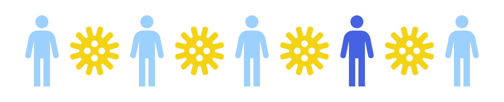

<!-- <link rel="stylesheet" href="https://cdn.jsdelivr.net/gh/jpswalsh/academicons@1/css/academicons.min.css"> -->
<!-- <link rel="stylesheet" href="https://cdnjs.cloudflare.com/ajax/libs/font-awesome/4.7.0/css/font-awesome.min.css"> -->


```{js navlink}
/*This code is the JQuery that adds quality-of-life-improvement navigation links (click the title or logo to be redirected to the homepage) to the nav bar. The original elements that RMarkdown creates are basic <span> elements and they don't process hrefs (links) as well as <a> (anchor) elements do. */

  $(document).ready( function(){
    /* When the document is ready (aka it has finished loading), do the following: */

      /* Replace the existing "navbar-brand" element with an anchor element that allows users to click on the title, "Epitutorials" and be redirected to the homepage */

      $(".navbar-brand").replaceWith("<a class='navbar-brand' href= 'index.html'>Epitutorials</a>")
      
      /* Replace the existing "navbar-logo" element with an image that has been styled to be vertically centered as well as padded, then wrap that image in an anchor element that allows users to click on the image to be redirected to the homepage */
      
    
    $(".navbar-logo").replaceWith("<div class='navbar-logo pull-left' ><a href='index.html'></a></div>")
    
    
    } // close the function that is run when the document is ready
  ) //close the document on ready function
```


```{r global, include=FALSE}
library(flexdashboard)
library(shiny)
```


About {data-orientation=rows}
===================================== 
Row
-----------------------------------------------------------------------
### {.no-title}
<center>

<h2>EpiTutorials</h2>
<p class="about"> Topics in Spatial Epidemiology </p> 
<p>Tutorials on spatial epidemiology topics built by Jon Zelner.</p>
</center>

Row
-----------------------------------------------------------------------
### {.no-title}
<center>
<h3 class="about-h">Modeling Spatial Epidemiology</h3>
<p class="about-site">Blurb about modeling spatial epidemiology topics. Lorem ipsum dolor sit amet, consectetur adipiscing elit. Aenean non fringilla ante, ac dignissim lorem. Pellentesque et diam nisl. Sed at nisi quam. Curabitur ornare urna at feugiat bibendum. Class aptent taciti sociosqu ad litora torquent per conubia nostra, per inceptos himenaeos. Ut commodo odio sit amet odio laoreet molestie. Mauris et arcu lacus. Vivamus sollicitudin metus ut iaculis consectetur. Duis ac sem nisl. Nunc viverra lorem non tellus pellentesque suscipit. Duis id tristique risus. Nam condimentum purus id dignissim rutrum. Curabitur eu dui egestas, accumsan ligula id, interdum felis. Interdum et malesuada fames ac ante ipsum primis in faucibus. Aliquam mattis velit a neque mattis, id semper magna vulputate.</p>
</center>

### {.no-title}
<center>
<h3 class="about-h">Understanding the Tutorials</h3>
<p class="about-site">Purpose, audience, and impact of these tutorials. Lorem ipsum dolor sit amet, consectetur adipiscing elit. Aenean non fringilla ante, ac dignissim lorem. Pellentesque et diam nisl. Sed at nisi quam. Curabitur ornare urna at feugiat bibendum. Class aptent taciti sociosqu ad litora torquent per conubia nostra, per inceptos himenaeos. Ut commodo odio sit amet odio laoreet molestie. Mauris et arcu lacus. Vivamus sollicitudin metus ut iaculis consectetur. Duis ac sem nisl. Nunc viverra lorem non tellus pellentesque suscipit. Duis id tristique risus. Nam condimentum purus id dignissim rutrum. Curabitur eu dui egestas, accumsan ligula id, interdum felis. Interdum et malesuada fames ac ante ipsum primis in faucibus. Aliquam mattis velit a neque mattis, id semper magna vulputate.</p>
</center>

Difference-In-Difference {data-orientation=rows data-navmenu="Learning Objectives"}
=====================================
Row
-----------------------------------------------------------------------
### **Estimating Treatment Effects from Spatial Data**


Hierarchical Models {data-orientation=rows data-navmenu="Learning Objectives"}
=====================================
Row
-----------------------------------------------------------------------
### **Hands-On with Hierarchical Models for Spatial Data**


Model Fit {data-orientation=rows data-navmenu="Learning Objectives"}
=====================================
Row
-----------------------------------------------------------------------
### **Likelihood and Model Fit: A Visual Tour**


Segregation Measures {data-orientation=rows data-navmenu="Learning Objectives"}
=====================================
Row
-----------------------------------------------------------------------
### **Simulating Segregation**


Segregation Transmission {.storyboard data-navmenu="Learning Objectives"} 
===================================== 
```{r, child="segTrans.Rmd"}
```


Simulation Inference {data-orientation=rows data-navmenu="Learning Objectives"}
=====================================
Row
-----------------------------------------------------------------------
### *Using Simulation to Better Understand Bayesian and Frequentist Inference**

