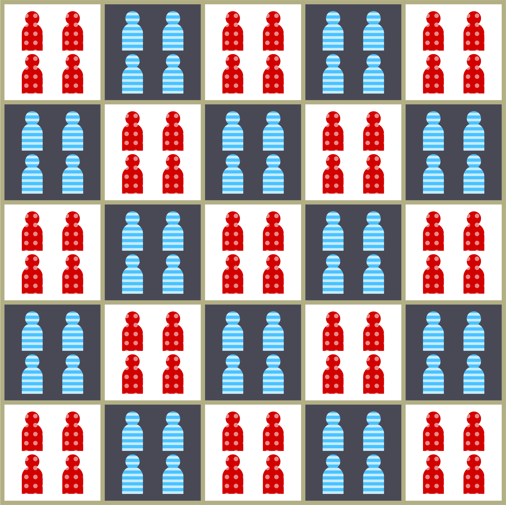

```{r setup, echo=FALSE, message=FALSE, warning=FALSE}
library(bslib)
require(dplyr)
require(ggplot2)
require(spdep)
require(shiny)
require(flexdashboard)
require(plotly)
require(colorspace)

#require(segregation)
##START OF SEGREGATION CODE##
multilevel_dataset <- function() {
  
  ## Make block motif 
  block <- data.frame(block = 1:4, high_risk_b = c(1,0,0,0), bx = c(1,1,2,2), by = c(1,2,1,2))
  
  neighborhood <- data.frame(neighborhood = 1:4, high_risk_n = c(1,0,0,0), nx = c(1,1,2,2), ny = c(1,2,1,2))
  
  quadrant <-data.frame(quadrant = 1:4, high_risk_q = c(1,0,0,0), qx = c(1,1,2,2), qy = c(1,2,1,2))
  
  ## Make neighborhood from 4 blocks
  neighborhoods <- list()
  for (i in 1:4) {
    ntmp <- block
    ntmp$neighborhood <- i
    neighborhoods[[i]] <- ntmp
  }
  
  neighborhoods <- dplyr::bind_rows(neighborhoods)
  
  quadrants <- list()
  for (i in 1:4) {
   qtmp <- neighborhoods
   qtmp$quadrant <- i
   quadrants[[i]] <- qtmp
  }
  
  quadrants <- dplyr::bind_rows(quadrants) %>% 
    inner_join(quadrant) %>%
    inner_join(neighborhood) %>%
    mutate(x = bx + 2*(nx-1) + 4*(qx-1), y = by + 2*(ny-1) + 4*(qy-1)) %>%
    select(-bx,-by,-qx,-qy,-nx,-ny)
    
  
  quadrants$high_risk_h <- 1
  quadrants$high_risk_h[quadrants$x > 4] <- 0
  
  return(quadrants)
}
risk_frame_fixed <- function(df, n, avg = 0.05, nor = 1 , bor = 1, qor = 1) {
  
  or <- exp(df$high_risk_n*log(nor) + df$high_risk_b*log(bor) + df$high_risk_q*log(qor))
  a <- (nrow(df)*avg)/sum(or)
  p <- a*or
  
  p[p > 1] <- 1
 
  return(p) 
}
risk_frame_logit <- function(df, alpha = 0.05, hor = 1, nor = 1 , bor = 1, qor = 1) {
  
  
  p <- plogis(qlogis(alpha) + df$high_risk_h*log(hor) + df$high_risk_n*log(nor) + df$high_risk_b*log(bor) + df$high_risk_q*log(qor))
  
  p[p > 1] <- 1
  
  return(p) 
}
draw_risk_frame <- function(alpha = 0.05, hor = 1, nor=1, bor=1, qor=1) {
  
  df <- multilevel_dataset()
  df$p <- risk_frame_logit(df, alpha, hor, nor, bor, qor)
  df$n <- rbinom(nrow(df), 1000, df$p)
  return(df)
}
long_risk_frame <- function(df) {
  
  d1 <- df
  d1$vaccinated <- 1
  
  
  d2 <- df
  d2$vaccinated <- 0
  d2$n <- 1000-d1$n
  
  
  
  dd <- rbind(d1, d2)
  ddd <- dd
  ddd$block <- paste0(dd$block,"_",dd$neighborhood,"_",dd$quadrant, "_", dd$high_risk_h)
  ddd$neighborhood <- paste0(dd$neighborhood,"_",dd$quadrant, "_", dd$high_risk_h)
  dd <- ddd
  dd$quadrant <- as.factor(dd$quadrant)
  dd$vaccinated <- as.factor(dd$vaccinated)
  dd$half <- as.factor(dd$high_risk_h)
  
  return(dd)
}
##END OF SEGREGATION CODE##
dissimilarity <- function(x,n) {
  total_a <- sum(x)
  total_b <- sum(n-x)
  d <- 0.5*sum(abs((x/total_a) - ((n-x)/total_b)))
  return(d)
}
half_grid <- function(d, ratio, N, p) {
  
  ## Sample number of unvaccinated in total population
  
  B <- rbinom(1, N, p)
  
  A <- N-B
  
  neighborhood_mat <- matrix(1, d, d)
  ncell <- length(neighborhood_mat)
  neighborhood_mat[, 1:floor(d / 2)] <- ratio
  
  neighborhood_df <- expand.grid(x = 1:d, y = 1:d)
  cell_rates <-
    as.vector(neighborhood_mat[cbind(neighborhood_df$y, neighborhood_df$x)])
  neighborhood_df$b <- rmultinom(1, B, cell_rates)
  neighborhood_df$a <- rmultinom(1, A, 1 / cell_rates)
  
  neighborhood_df$n <- neighborhood_df$a + neighborhood_df$b
  neighborhood_df$group <- neighborhood_df$b / neighborhood_df$n
  
  return(neighborhood_df)
  
}

#https://stackoverflow.com/questions/69239816/how-to-break-a-continuous-variable-into-discrete-intervals-using-only-ggplot2

blockbreaks <- seq(0, 1, by = 0.25)


grid_plot <- function(df) {
  
  g <- ggplot(df, aes(x = x, y = y, fill = cut (p, breaks = blockbreaks, limits=c(0,1),))) + 
    geom_tile() +
    geom_raster() +
    scale_fill_discrete_sequential(palette = "Blues 3",  name="Blocks")+   
    theme_bw() + 
    coord_equal() +
    guides(fill = guide_legend(title = "Proportion Unvaccinated")) +
    labs(color="Blues 3", x="x", y="y")+
    theme(
      legend.position = c(0,1),
      legend.justification = c(0,1),
      axis.title.x=element_blank(), #remove "x" label 
      axis.title.y=element_blank(),  #remove "y" label      
    )
  
  return(ggplotly(g))
}
proportion_hist <- function(df) {
  g <- ggplot(df, aes(x=p)) +
    geom_histogram(binwidth=0.005) +
    xlab("Proportion Unvaccinated") +
    ylab("Number of Blocks")
  return(g)
}
## Define a function to calculate Moran's I for an 
## arbitrary vector of values on a square grid
morans_grid <- function(d, ntype, x) {
  require(spdep)
  
  neighbors <- nb2listw(cell2nb(d,d, type=ntype))
  
  return(moran(x, neighbors, 1, 1))
  
}
isolation <- function(x,n) {
  x <- x[n > 0]
  n <- n[n > 0]
  total_a <- sum(x)
  d <- sum((x/total_a)*(x/n))
  return(d)
}
interaction <- function(x,n) {
  x <- x[n > 0]
  n <- n[n > 0]
  total_a <- sum(x)
  d <- sum((x/total_a)*((n-x)/n))
  return(d)
}
theil <- function(df, top_unit) {
  segregation::mutual_total(df, "vaccinated", top_unit, weight = "n" )[2,2]
}
theil_within <- function(df, top_unit, inside_unit) {
  segregation::mutual_total(df, "vaccinated", inside_unit, within=top_unit, weight = "n" )[2,2]
}
## Size of the total population
total_pop <- 100000
d <- 8
```

## Spatial Clustering Metrics
### Before We Get Started...

Let's review some key metrics of spatial clustering that are often used in epidemiological research.

We will go over:

- **Isolation** (and its inverse, **Interaction**)
- **Dissimilarity**
- **Moran's I**

#### Notation

We will use the following notation throughout:

- $A$ = Total number of majority group members.

- $B$ = Total number of minority group members (i.e. $B$ < $A$).

- $a_i$ = Number of majority group members in area $i$.

- $b_i$ = Number of minority group members in area $i$.

- $t_i$ = Total population of area $i$ (i.e. $a_i + b_i$).

- $N$ = Total overall population size (i.e. $A + B$).

## Metric: Isolation & Interaction
### Isolation

If we have two groups $a$ and $b$, in which $b$ is a minority group, i.e. $N_{b} < N_{a}$, isolation measures the **proportion of the contacts among minority group members** that are within-group. 

Isolation can be calculated as:

$$
\sum_{i}^{N}\left[\left(\frac{b_i}{B}\right)\left(\frac{b_i}{t_i}\right)\right]
$$
In `R` we can write this as:
```{r eval=FALSE}
isolation <- function(a,b) {
  t <- a + b
  a <- a[n > 0]
  b <- b[n > 0]
  total_b <- sum(b)
  d <- sum((b/total_a)*(t/n))
  return(d)
}
```

- $b$ is a **vector**: each entry in the vector represents the number of **minority group members** in each area $i$
  - the vector $b$ has a length of $G$, where $1 \le i \le G$
- $a$ is a **number**: it represents the number of **majority group members** in each area $i$


<h3> Interaction </h3>

Interaction quantifies the **inverse of isolation**: what proportion of the minority group's contacts are with the majority group:

$$
\sum_{i}^{N}\left[\left(\frac{b_i}{B}\right)\left(\frac{a_i}{t_i}\right)\right]
$$

## Metric: Dissimilarity
### Dissimilarity

Another common measure of clustering or segregation is the **index of dissimilarity**. This takes on a value between 0 and 1 and indicates the **proportion** of the majority or minority group that moves to match overall population-level distributions.


$$
\frac{1}{2}\sum_{i}^{N} \left| \frac{a_i}{A} - \frac{b_i}{B} \right|
$$

Each "term" (i.e. $\frac{a_i}{A}$) inside the vertical bars (which indicate absolute value) represents the **proportion of the total population of each group living in area $i$**. 

If both $\frac{a_i}{A}$ and $\frac{b_i}{B}$ equal 0, that means that the proportion of majority and minority group members in each area $i$ **is the same as** the overall proportion of majority and minority group members in the general population. 

Similarly, for this value to sum to 1, each area $i$ will only have members of one group (either all majority or all minority) present.


This is also easy to write out in `R`:

```{r, eval=FALSE}
dissimilarity <- function(a,b) {
  total_a <- sum(x)
  total_b <- sum(n-x)
  d <- 0.5*sum(abs((a/total_a) - ((b)/total_b)))
  return(d)
}
```

## Metric: Moran's I
### Moran's I
The prior two measures (Isolation/Interaction and Dissimilarity) are **aspatial** — that means that **areal factors** such as census tract, neighborhood, and zipcode **don't impact them**. 

You can tell this is the case because the equations for each includes nothing about the **distance** between locations or the **adjacency** of locations (for instance, there isn't information on whether or not locations are touching each other at any point). 

To calculate Moran's I, we'll introduce a couple of new items of notation:

- $w_{ij}$ is the **weight of connection** between areas $i$ and $j$. We will assume that $w_{ij} = 1$ when two areas are touching, and that $w_{ij} = 0$ otherwise. 
  - $w$ can be more complicated — it can be a **function of distance** as well.

- $W$ is the sum of all the weights.

We can then define Moran's I like this:

$$
\frac{N}{W} \frac{\sum_{i} \sum_{j} w_{ij}(\frac{b_i}{B} - \frac{B}{N})(\frac{b_j}{B} - \frac{B}{N})}{\sum_{i}(\frac{b_i}{B} - \frac{B}{N})^2}
$$

You can see here that instead of evaluating individual cells one at a time, **we look at them in pairs**. 

Each $\frac{b_i}{B} - \frac{B}{N}$ term is measuring the **deviation** from the population-average proportion of the minority group for each location. The closer $(\frac{b_i}{B}- \frac{B}{N})$ and$(\frac{b_j}{B}- \frac{B}{N})$ are to each other among pairs with larger weights, the greater the value of **I**. 

Unlike with the first two measures, **I** can take on negative and positive values.

- **1** (*a dissimilarity value of 1*) indicates perfect correlation. All individuals are clustered among like-individuals.
- **-1** indicates perfect repulsion, like a checkerboard:

```{r, fig.align="center", echo=FALSE, out.width="50%", fig.cap="*Majority group individuals and Minority group individuals forming perfectly repelled clusters.*"}

```

- **0** indicates a fully random distribution, analogous to a 0 in the index of dissimilarity.

## Measuring Clusters
### Clustering in the City: A Hypothetical Scenario
In this example, we'll look at different ways of measuring the concentration of unvaccinated children in different neighborhoods of a hypothetical city. 

The clustering of unvaccinated individuals may indicate an **elevated risk of outbreaks** of preventable childhood infections, such as measles. 

An ideal measure of the risk associated with this clustering would map well onto our **qualitative** understanding of the process of infectious disease transmission.


<center><h4 style="font-weight: bold; font-style: oblique">How does clustering impact outbreak levels?<h4></center>


To explore this question, we'll start with a simple scenario:

We have city in which each individual lives in 1 of 64 blocks that are divided into **groups of 32**, half on the **high-risk west (left) side** and half on the **lower-risk east (right) side**.

In addition to the east and west side, let's break the city down further into:

1. 4 **quadrants**, which each contain
2. 4 **neighborhoods** (16 neighborhoods per quadrant, 32 total neighborhoods), which contain
3. 4 **blocks** each (16 blocks per neighborhood, 64 total blocks)

```{r, fig.align="center", echo=FALSE, out.width="60%", fig.cap="*Quadrants, Neighborhoods, and Blocks*"}

```

Within each of the quadrant and neighborhood, there is one **high risk area**, corresponding to the bottom-left neighborhood or block, respectively. You can control the odds of unvaccinated-ness for children living in the high-risk areas as compared to their enclosing neighborhoods and blocks using the sliders below the figure.

```{r makegrid, echo=FALSE}
sidebarLayout(
  sidebarPanel(
    h4("Model Parameters"),
    sliderInput(
      "punvax",
      "Proportion Unvaccinated in Lowest Risk Area",
      min = 0.01,
      max = 0.5,
      value = 0.1
    ),
    sliderInput(
      "hor",
      "High-Risk (left side) Odds Ratio",
      min = 1.01,
      max = 10.0,
      value = 1.1
    ),
    
    
  radioButtons("ntype", "Neighbor Type:",
               c("Rook" = "rook",
                 "Queen" = "queen")),
  ),
  
  # mainPanel(tabsetPanel(
  #   type = "tabs",
  #   tabPanel("Map", plotlyOutput("initialPlot")),
  #   tabPanel("Population", plotOutput("proportionNonVax"))
  # )))
  mainPanel(plotlyOutput("initialPlot")))
```


```{r, statsgrid, echo=FALSE}
wellPanel(
  fluidRow(
    column(12,
           h5("High-risk Odds Ratios", style="font-weight:bold;")
    )
  ),
  fluidRow(
    column(
      4,
      sliderInput(
        "qor",
        "At Quadrant",
        min = 1.0,
        max = 10.0,
        value = 1.0
      )
    ),
    column(
      4,
      sliderInput(
        "nor",
        "At Neighborhood",
        min = 1.0,
        max = 10.0,
        value = 1
      )
    ),
    
    column(4,
           sliderInput(
             "bor",
             "At Block",
             min = 1.0,
             max = 10.0,
             value = 1.0
           )),
  )
)
fluidRow(column(
  12,
  fluidRow(
    column(3,
           h5("Unvaccinated", style="font-weight:bold;"),
           gaugeOutput("unvaxgauge")),
    column(3,
           h5("Dissimilarity", style="font-weight:bold;"),
           gaugeOutput("dissimgauge")),
    column(3,
           h5("Isolation", style="font-weight:bold;"),
           gaugeOutput("isogauge")),
    column(3,
           h5("Moran's I", style="font-weight:bold;"),
           gaugeOutput("morangauge")),
  ),
  fluidRow(
    column(3,
           h5("Theil Index", style="font-weight:bold;"),
           gaugeOutput("theilgauge")),
    column(3,
      h5("Theil Decomposition", style="font-weight:bold;"),
      textOutput("quadtheil"),
      textOutput("withinquadtheil"),
    )
  )
),)
  
```

```{r, context="server", code=readLines("src/server.R")}
```