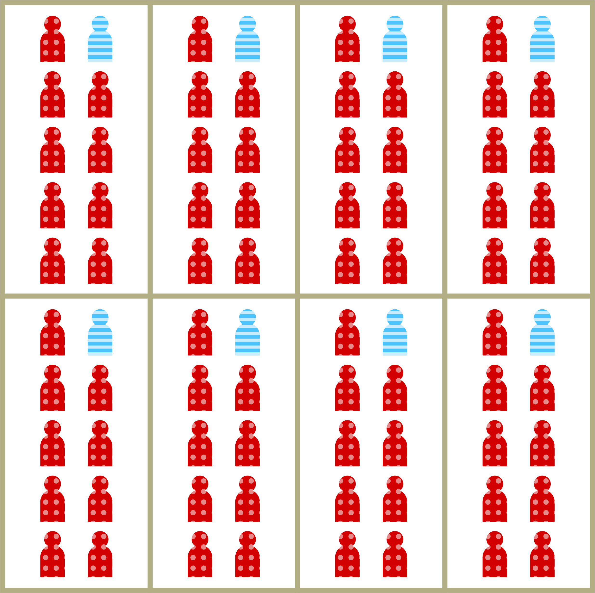
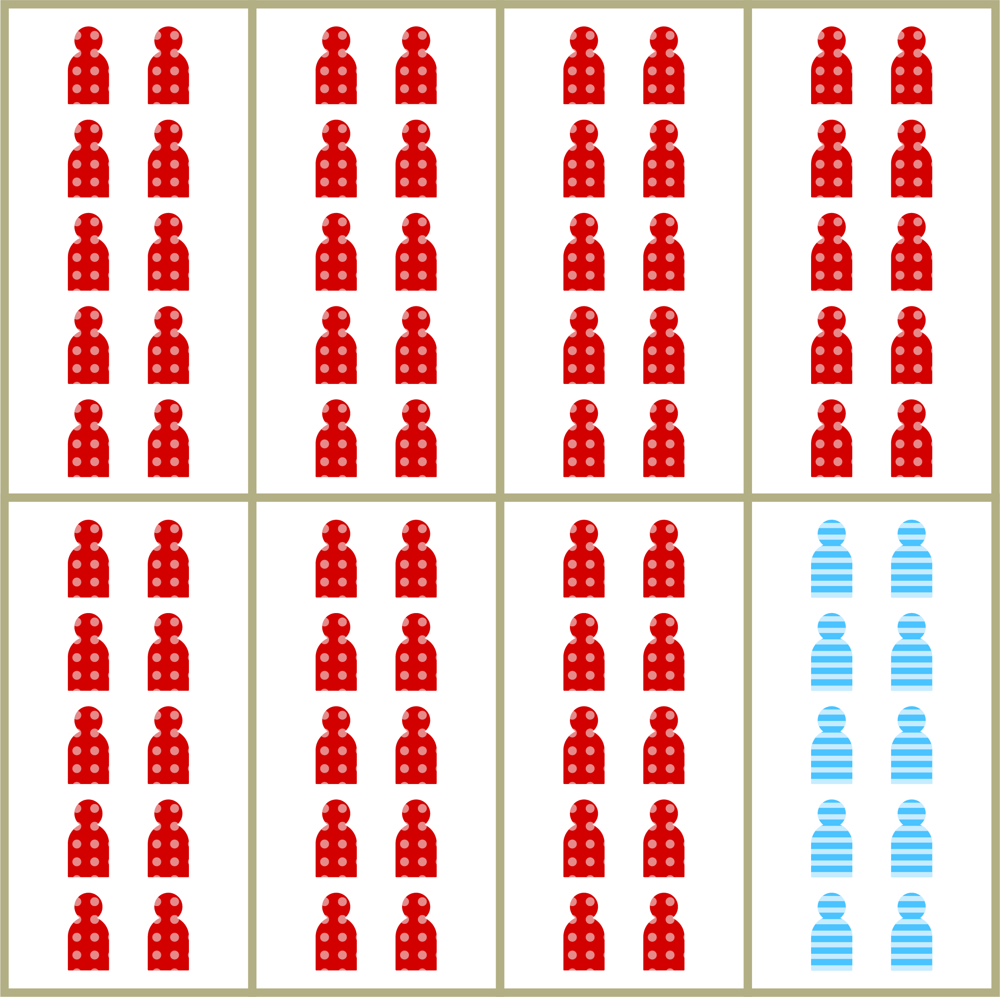
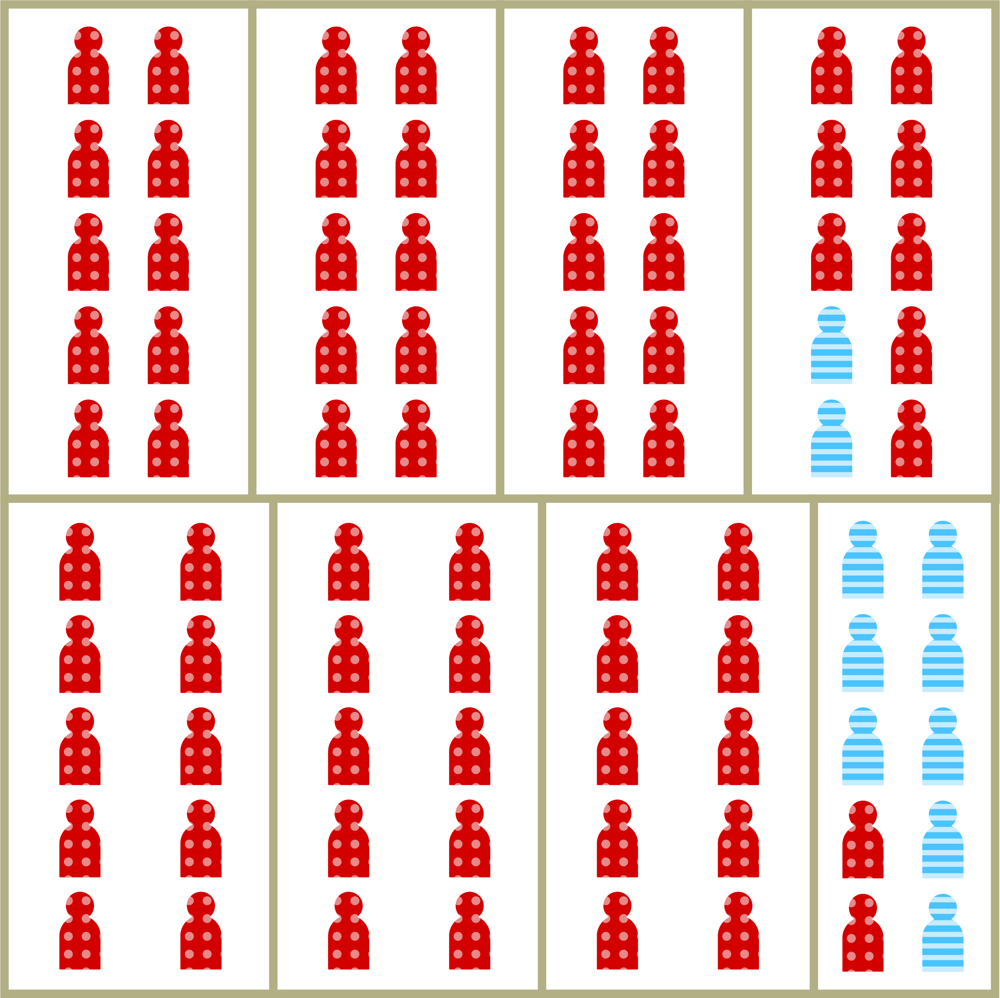

```{r setup, echo=FALSE, message=FALSE, warning=FALSE}
require(deSolve)
require(dplyr)
require(DiagrammeR)
require(flexdashboard)
require(plotly)

two.group.sir.model <- function(t, x, params) {
  S1 <- x[1]
  I1 <- x[2]
  R1 <- x[3]
  p1 <- sum(x[1:3])
  S2 <- x[4]
  I2 <- x[5]
  R2 <- x[6]
  p2 <- 1-p1
  
  ## now extract the parameters
  beta <- params["beta"]
  gamma <- params["gamma"]
  tau <- params["tau"]
  rho <- params["rho"]
  
  ## Calculate proportion of within-between group contact
  ## for each group
  g1_within <- tau/p1
  g1_between <- (1-tau)/p2
  g2_within <-  (1-(p1*g1_between))/p2
  g2_between <- (p1*g1_between)/p1
  
  lambda_1 <- rho*beta*S1*(g1_within*I1 + g1_between*I2)
  lambda_2 <- beta*S2*(g2_within*I2 + g2_between*I1)
  
  ## now code the model equations
  dS1dt <- -lambda_1
  dI1dt <- lambda_1-gamma*I1
  dR1dt <- gamma*I1
  ## now code the model equatios
  dS2dt <- -lambda_2
  dI2dt <- lambda_2-gamma*I2
  dR2dt <- gamma*I2
  ## combine results into a single vector
  dxdt <- c(dS1dt,dI1dt,dR1dt,dS2dt,dI2dt,dR2dt)
  ## return result as a list!
  list(dxdt)
  
}

```

## Introduction
### How Does Residential Segregation Impact Infection Risk?

In this tutorial, we're going to walk through ways in which patterns of residential segregation may impact infectious disease risk through two different pathways, **contact and susceptibility**, and how that is likely to impact spatial and socioeconomic patterns of infection incidence. 

To do this, we'll build on the framework developed by **[Acevedo-Garcia (2000)](https://www.sciencedirect.com/science/article/pii/S0277953600000162)** to relate the **social processes** governing and generating residential segregation to the **biological manifestations** of disease.

Specifically, we'll...

- Walk through the hypothesized relationships between segregation and patterns of contact;

- Take a hands-on approach to understanding the way different intensities and modalities of segregation **impact patterns** of *within* and *between-group* contact; and finally,

- Put these contact patterns into an infectious disease **transmission model** and look at their implications for risk, both at the population and group level.


## A Modeling Framework
### Acevedo-Garcia's Model

Acevedo-Garcia (2000) presented a helpful model of the **relationship between residential segregation and infectious disease risk.** 

Specifically, she identified a number of different **measures of the intensity of segregation** and hypothesized about their potential relationships to infection risk. She focused on Tuberculosis, but we can think of this as a more general approach.

### Majority-Minority Break

In this model, the world is broken down into <u>two groups</u>: 

<center><span style="font-size: 24px; font-weight: bold;">majority<span></center>

```{r, echo=FALSE, fig.align="center", out.width="10%", fig.show='hold', fig.cap="*Majority groups will be represented as red with a polka-dot pattern.*"}

```

<center> and </center> 

<center><span style="font-size: 24px; font-weight: bold;">minority</span></center>
```{r, echo=FALSE, fig.align="center", out.width="10%", fig.show='hold', fig.cap="*Minority groups will be represented as blue with a striped pattern.*"}

```

Typically, residential segregation can be thought of in **racial** or **socioeconomic** terms. But at the end of the day, all of the insights about segregation are applicable to thinking about patterns of contact and risk in any setting where you have two interacting populations, and differing rates of **within** and **between-group** contact. 

### Context Matters

It's also important to remember that **these processes occur in many contexts** and not only along the lines we typically think of as characterizing residential segregation in the United States. 

For example, in many countries, recent arrivals to a city from the countryside may live in shantytowns that induce higher rates of within-group contact as well as a higher intensity of exposure due to **local environmental and social factors**.

### Disparities Depend on Two Main Attributes

```{r, fig.align="center", echo=FALSE, out.width="50%", fig.cap="*Relating residential segregation to infection risk, from Acevedo-Garcia (2000).*"}
knitr::include_graphics("images/acevedo_garcia_conceptual.png")
```

After reviewing the literature and the different approaches to measuring segregation, she concludes that disparities in infection risk related to segregation can be conceptualized primarily as a function of two attributes, specifically:

1. **Isolation:** This refers to the **proportion** of an average group member's interactions that occur **within that group.** This captures the aspect of residential segregation that makes within-group contact for both minority and majority groups more likely than we would expect by chance alone.

For example, this image shows a situation of **low isolation** in which members of the minority group (in blue) are evenly distributed throughout neighborhoods of a hypothetical city:

```{r, fig.align="center", echo=FALSE, out.width="50%", fig.cap="*An example of low isolation, from Acevedo-Garcia (2000).*"}

```
Specifically, the blue individuals represent 10% of the population and are evenly dispersed throughout, so that each block has 10% of its members from the blue group and 90% from the red group, reflecting the population distribution.

By contrast, this image shows a situation in which **isolation is very high**, where blue individuals only contact other blue individuals, and the same goes for those in the red group:

```{r, fig.align="center", echo=FALSE, out.width="50%", fig.cap="*An example of high isolation, from Acevedo-Garcia (2000).*"}

```

2. **Concentration:** This refers to the **density** or **intensity** of contacts individuals have. We can think of this as reflecting crowded living conditions, in which minority-group members have not only a **higher rate** of contact with members of their group, but also that each of those contacts has a **greater intensity** than do their contacts with out-group members. 

```{r, fig.align="center", echo=FALSE, out.width="50%", fig.cap="*An example of high isolation and high concentration, from Acevedo-Garcia (2000).*"}

```


In the next section, we will explore how these factors come together to impact patterns and intensities of contact within and between minority and majority groups.


## Simulating Patterns of Contact 

```{r contact, echo=FALSE}
fluidPage(
  fluidRow(
    column(4,
           
           h4("Model Parameters"),
           
           sliderInput(
             "p1a",
             "Proportion of Population in Minority Group",
             min = 0.01,
             max = 0.49,
             value = 0.1
           ),
           #uiOutput("isoslider"),
           sliderInput(
             "taua",
             "Minority Group Isolation",
             min = 0.0,
             max = 1,
             value = 0.1
           ),
           # actionButton("simulate", "Draw contacts!")
           
    ),
    
    column(8,
           tabsetPanel(
             tabPanel("Minority Group", plotlyOutput("contactA")),
             tabPanel("Majority Group", plotlyOutput("contactB"))
           )
    )),
  
  fluidRow(
    column(4, offset = 4,
           h5("Proportion of Minority Group Contacts w/Majority"),
           gaugeOutput("gauge2")
    ),
    column(4,
           h5("Proportion of Majority Group Contacts w/Minority"),
           gaugeOutput("gauge"))
    
  )
  
)
```

In the demo above, you can explore the impact of some key parameters on the distribution of contacts an individual has. The plots show you 100 contacts of individuals in the minority (blue) and majority (red) groups, respectively. 

The **size of the dots** indicates the **relative susceptibility** of individuals in the segregated minority group. 

We can think of the susceptibility as multiplying the risk of infection.


<h3> Random Mixing $\ne$ No Isolation </h3>

One thing to pay attention to is what happens when isolation < proportion in the minority group. 

**In a well-mixed population, i.e. where individuals contact each other without regard to group membership, isolation = proportion in the minority group.** 

When isolation is lower than the proportion in the group, this means that individuals in that group *preferentially* have contact with those in the majority group.

<h3> Isolation vs Interaction </h3>

When we talk about the relationship between segregation and infectious disease disparities, we're really talking about the way that segregation impacts rates of transmission **within** and **between** the two groups. In this sense, **isolation** is really only part of the equation: the other one is **interaction**, i.e. how much contact the minority group has with the majority group and vice-versa. 

In a scenario with just two groups, this is simple: The **interaction** of minority group members with majority group members is just `1 - isolation`, i.e. the proportion of contacts not used up by within-group contact.

<h3> How Do Population Share and Isolation Interact? </h3>

Try adjusting the proportion of individuals in the minority vs. majority group, the isolation of the minority group, and the relative susceptibility of the minority group as compared to the majority group.  

The image in the figure shows the distribution of 100 randomly selected contacts of an individual in either the minority or majority group, with majority group individuals in red and minority group members in blue.


## Simulating Transmission

Now, let's think about how these factors, of isolation, concentration, and susceptibility, may related to the dynamics of transmission. 

The diagram below shows the states *susceptible-infected-recovered* model with two groups, representing the *red* majority group individuals and the *green* minority group individuals:

```{r, fig.align="center", echo=FALSE, out.width="30%", fig.cap="An SIR model with two groups."}
knitr::include_graphics("images/sir_flow_chart.png")
```

For a refresher on SIR Models check out the [Wikipedia page](https://en.wikipedia.org/wiki/Compartmental_models_in_epidemiology#The_SIR_model), and [this tutorial](https://ncase.me/covid-19/).

Briefly, in this model, individuals can be in one of the three states. *Susceptible* individuals (marked by S) are those who are able to be infected, *infected* individuals are those can infect susceptible individuals and move them into the *I* class. Finally, in this model, when an individual recovers after some period of time, they enter the *R* class and are assumed to be immune from future infection.

### How does segregation drive inequality in outcomes?

We'll extend the basic SIR model by splitting everyone up into two groups, with one set of disease states for the red majority group members and another for the green minority group members. We've added two more parameters to the contact ones from the last exercise. Now we have the *daily infectiousness*, i.e. the risk that a majority group individual with infect another majority group individual on each day. We have also added the average duration of infection in days. The second parameter is the average duration of infectiousness. **Remember, more days on which to be infectious = more infections if you keep the daily infectiousness constant.**

The contact parameters are the same as before, but now they are governing the rate of contact both *within* and *between* the majority and minority groups. 

### What happens when *susceptibility* meets *isolation*?

The rate of transmission is a function of who you contact as well as how likely those contacts are to infect you. So, if susceptibility = 2, for each infectious individual they are exposed to, a susceptible individual in the minority group would have double the risk of infection as an equivalent individual in the majority group. 

For example, this might occur in a situation where individuals in the minority group live in more cramped conditions with poor air circulation, making the likelihood of infection upon exposure greater for those in the minority than the majority. For vaccine-preventible diseases, it could be the case that individuals in the minority group are less likely to be vaccinated than those in the majority, making them more susceptible to infection.

### Try it out

The value $R0$ at the bottom is the basic reproduction number, i.e. the average number of individuals infected by single case in a totally susceptible population. This value is important because if $R0 > 1$, we should expect to see outbreaks, but if it is less than 1, we should expect transmission to fizzle out. 

Try different values of the slider and press "Run Model!" to update the output. In the figure, the red line represents the total number of infections in the majority group, the green line represents the total number of infections in the minority group, and the black line is the total overall out of a population of 100,000 individuals. The red and green dashed lines show the maximum number of possible infections for the majority and minority groups, respectively. 

```{r makegrid, echo=FALSE}
sidebarLayout(
  sidebarPanel(
    h4("Model Parameters"),
    sliderInput(
      "beta",
      "Infections per case/day",
      min = 0.01,
      max = 1.0,
      value = 0.1
    ),
    sliderInput(
      "gamma",
      "Duration of infectiousness (days)",
      min = 1,
      max = 5,
      value = 3,
      step = 0.25
    ),
    sliderInput(
      "p1",
      "Proportion in group 1",
      min = 0.01,
      max = 0.49,
      value = 0.1
    ),
    #uiOutput("isoslider"),
    sliderInput(
      "tau",
      "Minority Group Isolation",
      min = 0.0,
      max = 1,
      value = 0.5
    ),
    sliderInput(
      "rho",
      "Minority Group Concentration",
      min = 1.0,
      max = 5.0,
      value = 1.0,
      step = 0.1
    ),
    h5("Overall R0"),
    gaugeOutput("overallR"),
    
    actionButton("runmodel", "Run Model!")
    
    
    
  ),
  
  mainPanel(
    plotlyOutput("incidence"),
    fluidRow(
      column(4,
             h4("Number of infections from introducing 1 case into:")),
      column(4,
             h5("Minority Group"),
             gaugeOutput("gaugeA")),
      column(4,
             h5("Majority Group"),
             gaugeOutput("gaugeB"))
    ),
    fluidRow(
      column(4,
             h5("Minority Group Incidence"),
             gaugeOutput("minIncGauge")),
      column(4,
             h5("Majority Group Incidence"),
             gaugeOutput("majIncGauge")
      ),
      column(4,
             h5("Relative Risk"),
             gaugeOutput("rrGauge")
      )
    )
  )
)
```

**Discussion Questions**

The text below the plot shows the final proportion of the population of each group that was infected at the end of the simulation, as well as the *relative* risk of infection for individuals in the minority vs. majority group. Use this information as well as your observations from running the transmission model with different input parameter values to think about the following questions:

1. What seems to be the most important factor in driving *inequality* in the number of infections at the end of the outbreak?

2. Is there a relationship between *infectiousness* and inequality? In other words, is inequality in infection risk greater or lower at high levels of infectiousness?

3. What impact does the susceptibility of the minority group have on population-level patterns of disease? Are there situations in which the minority group may have very high rates of infection, but the population as a whole does not? When does this happen?

```{r, context="server"}

modelPars <- eventReactive(input$runmodel, {
  params <- c(beta=input$beta,
              gamma=1/input$gamma,
              rho=input$rho, 
              tau=input$tau,
              p1=input$p1)
  
  return(params)
  
}, ignoreNULL=FALSE)

modelRun <- reactive({
  params <- modelPars()
  times <- seq(from=0,to=365,by=1) # returns a sequence
  p1 <- params[["p1"]]
  p2 <- 1-p1
  xstart <- c(S1=0.999*p1,I1=0.001*p1,R1=0.0,S2=0.999*p2,I2=0.001*p2,R2=0.000) 
  
  out <- as.data.frame(
    ode(
      func=two.group.sir.model,
      y=xstart,
      times=times,
      parms=params
    ))
  
  return(out)
  
})

# modelFigures is called in the incidence output for the majority-minority model

modelFigures <- reactive({
  params <- modelPars()
  
  require(ggplot2)
  require(plotly)
  
  p1 <- params[["p1"]]
  p2 <- 1-p1
  
  g <- ggplot(modelRun(), aes(x=time)) + geom_line(aes(y = 1e5*R1), colour = "blue") + geom_line(aes(y=1e5*R2), colour = "red") + xlab("Day") + 
    geom_line(aes(y=1e5*(R1+R2))) + 
    ylab("Cumulative Number Infected") + 
    ylim(0,1e5) +
    geom_hline(yintercept = 1e5*p1, linetype = "dashed", colour = "blue") +
    geom_hline(yintercept = 1e5*p2, linetype = "dashed", colour = "red") + 
    theme_bw()
  
  p <- ggplotly(g)
  
  return(p)
})

output$incidence <- renderPlotly({
  return(modelFigures())
})


# to make contactA update on input updates, it listens to list(input$p1a, input$taua)
contactA <- eventReactive(list(input$p1a, input$taua),{
  require(packcircles)
  require(ggplot2)
  require(plotly)
  
  num_contacts <- 150
  intensity <-1# input$rhoa
  p1 <- input$p1a
  p2 <- 1-p1
  a_in_contact_p <- input$taua
  a_out_contact_p <- 1-a_in_contact_p
  b_in_contact_p <- (p2-(p1*a_out_contact_p))/p2
  b_out_contact_p <- 1-b_in_contact_p
  
  
  ## Make a dataframe with circles for the in-group
  num_in <- round(num_contacts*a_in_contact_p)
  num_out <- num_contacts-num_in
  
  print(num_contacts)
  print(input$taua)
  print(intensity)
  print(num_in)
  print(num_out)
  
  df <- data.frame(group = c(rep(2, num_in), rep(1, num_out)),
                   ingroup_ratio = c(rep(intensity, num_in),rep(1, num_out)))
  print(df$ingroup_ratio)
  df$intensity <- rbeta(nrow(df), 20,20)*df$ingroup_ratio
  
  limits <- c(-5,5)
  res <- circleRepelLayout(df$intensity, xlim = limits, ylim = limits)
  
  dat.gg <- circleLayoutVertices(res$layout, sizetype = "radius")
  
  df$id <- 1:nrow(df)
  
  dat.gg <- dat.gg %>%
    inner_join(select(df, id, intensity,group)) 
  dat.gg$group <- as.factor(dat.gg$group)
  
  
  t <- theme_bw() +
    theme(panel.grid = element_blank(),
          axis.text=element_blank(),
          axis.ticks=element_blank(),
          axis.title=element_blank())
  
  theme_set(t)
  
  g <- ggplot(data = dat.gg, aes(x, y, group = id)) +
    geom_polygon(aes(fill=group, colour=group),alpha=0.3) +
    coord_equal(xlim=limits, ylim=limits) + 
    scale_fill_manual(breaks = c("1", "2"), 
                      values=c("red", "blue")) + 
    theme(legend.position = "none")
  
  p <- ggplotly(g)
  
  return(p)
  
}, ignoreNULL=FALSE)

output$contactA <- renderPlotly({
  return(contactA())
})

# interactionRates calculates the interaction rates given p1a and taua
interactionRates <- reactive({
  p1 <- input$p1a
  p2 <- 1-p1
  a_in_contact_p <- input$taua
  a_out_contact_p <- 1-a_in_contact_p
  b_in_contact_p <- (p2-(p1*a_out_contact_p))/p2
  b_out_contact_p <- 1-b_in_contact_p
  
  group_values <- list(majority = b_out_contact_p, 
                       minority = a_out_contact_p, 
                       dissimilarity = abs((a_in_contact_p)-(1-a_in_contact_p)))
  
  return(group_values)
})

output$majorityIsolation <- renderText({
  ir <- interactionRates()
  sprintf("Majority Group Isolation = %0.2f", 1-ir$majority)
})

output$dissimilarity <- renderText({
  ir <- interactionRates()
  sprintf("Dissimilarity = %0.2f", ir$dissimilarity)
})


# to make contactB update on input updates, it listens to list(input$p1a, input$taua)
contactB <- eventReactive(list(input$p1a, input$taua), {
  require(packcircles)
  require(ggplot2)
  require(plotly)
  
  num_contacts <- 150
  intensity <- 1 #input$rhoa
  p1 <- input$p1a
  p2 <- 1-p1
  a_in_contact_p <- input$taua
  a_out_contact_p <- 1-a_in_contact_p
  b_in_contact_p <- (p2-(p1*a_out_contact_p))/p2
  b_out_contact_p <- 1-b_in_contact_p
  
  
  ## Dataframe with circles for the other group
  num_in <- round(num_contacts*b_in_contact_p)
  num_out <- num_contacts-num_in
  df_b <- data.frame(group = c(rep(1, num_in), rep(2, num_out)))
  df_b$intensity <- rbeta(nrow(df_b), 20,20)
  
  
  limits <- c(-5,5)
  res <- circleRepelLayout(df_b$intensity, xlim = limits, ylim = limits)
  
  dat.gg <- circleLayoutVertices(res$layout, sizetype = "radius")
  
  df_b$id <- 1:nrow(df_b)
  
  dat.gg <- dat.gg %>%
    inner_join(select(df_b, id, intensity,group)) 
  dat.gg$group <- as.factor(dat.gg$group)
  
  
  t <- theme_bw() +
    theme(panel.grid = element_blank(),
          axis.text=element_blank(),
          axis.ticks=element_blank(),
          axis.title=element_blank())
  
  theme_set(t)
  
  g <- ggplot(data = dat.gg, aes(x, y, group = id)) +
    geom_polygon(aes(fill=group, colour=group),alpha=0.3) +
    coord_equal(xlim=limits, ylim=limits) + 
    scale_fill_manual(breaks = c("1", "2"), 
                      values=c("red", "blue")) + 
    theme(legend.position = "none")
  
  p <- ggplotly(g)
  
  return(p)
  
}, ignoreNULL=FALSE)

output$contactB <- renderPlotly({
  return(contactB())
})

# the gauge for overall R updates on changing p1 and tau
output$overallR <- renderGauge({
  p1 <- input$p1
  p2 <- 1-p1
  tau <- input$tau
  a_to_b <- (1-((p1*(1-tau))/p2))
  lambda_1 <- input$rho*(p1*tau + p2*a_to_b )
  lambda_2 <- (p1*(1-tau) + p2*(1-a_to_b))
  
  R0 <- input$beta*input$gamma*(lambda_1 + lambda_2) 
  
  gauge(round(R0,2),
        min = 0,
        max = 20,
        sectors = gaugeSectors(
          colors=c("blue", "red")
        ))
  
})

# this groups risk and is called for gauges A and B
groupR <- reactive({
  p1 <- input$p1
  p2 <- 1-p1
  tau <- input$tau
  a_to_b <- (p1*(1-tau))/p2
  
  # ## Risk to minority group
  lambda_1 <- input$rho*(p1*tau + p2*(1-tau))
  # 
  # a_to_b <- (1-(p1*tau))/p2
  # ## Risk to majority group
  lambda_2 <- (p1*a_to_b + p2*(1-a_to_b))
  
  lambda_1 <- (input$rho * tau) + (1-tau)
  lambda_2 <- (input$rho* a_to_b) + (1-a_to_b)
  
  
  R <- input$beta*input$gamma
  
  groupR0 <- data.frame(minority = R*lambda_1, majority = R*lambda_2)
  return(groupR0)
  
})

# gaugeA updates on changing p1 and tau

output$gaugeA <- renderGauge({
  ir <- groupR()
  gauge(round(ir$minority,2),
        min = 0,
        max = 20,
        sectors = gaugeSectors(
          colors=c("blue", "red")
        ))
})

output$gaugeB <- renderGauge({
  ir <- groupR()
  gauge(round(ir$majority,2),
        min = 0,
        max = 20,
        sectors = gaugeSectors(
          colors=c("blue", "red")
        ))
})


output$finalRisk <- renderText({
  
  rv <- riskVals()
  x <- paste0("Minority group total incidence = ", rv[["min_inc"]], "  Majority group total incidence = ", rv[["maj_inc"]], "  Risk ratio = ", rv[["rr"]])
  
  return(x)
})

riskVals <- reactive({
  
  df <- modelRun()
  params <- modelPars()
  p1 <- params[["p1"]]
  minority_inc_pr <- 100*round(df$R1[nrow(df)]/p1,2)
  majority_inc_pr <- 100*round((df$R2[nrow(df)]/(1-p1)),2)
  rr <- round((df$R1[nrow(df)]/p1)/((df$R2[nrow(df)]/(1-p1))),2)
  
  outVals <- list(min_inc = minority_inc_pr,
                  maj_inc = majority_inc_pr,
                  rr = rr)
  
  return(outVals)
  
})

output$minIncGauge <- renderGauge({
  rv <- riskVals()
  gauge(rv[["min_inc"]],
        min = 0, 
        max = 100,
        sectors = gaugeSectors(
          success = c(0, 10),
          warning = c(10, 50),
          danger  = c(50,100),
          colors = c("blue", "red")
          ))
  
})

output$majIncGauge <- renderGauge({
  rv <- riskVals()
  gauge(rv[["maj_inc"]],
        min = 0, 
        max = 100,
        sectors = gaugeSectors(
          success = c(0, 10),
          warning = c(10, 50),
          danger  = c(50,100),
          colors = c("blue", "red")
          ))
  
})

output$rrGauge <- renderGauge({
  rv <- riskVals()
  gauge(rv[["rr"]],
        min = 0, 
        max = 20,
        sectors = gaugeSectors(
          success = c(0, 1.5),
          warning = c(1.5, 5),
          danger  = c(5,20),
          colors = c("blue", "red")          
          ))
  
})


output$gauge <- renderGauge({
  ir <- interactionRates()
  gauge(round(ir$majority,2),
        min = 0,
        max = 1,
        sectors = gaugeSectors(
          success = c(0.0, 0.25), 
          warning = c(0.25, 0.75), 
          danger = c(0.75, 1),
          colors = c("blue", "red")
          ))
})

output$gauge2 <- renderGauge({
  ir <- interactionRates()
  gauge(round(ir$minority,2),
        min = 0,
        max = 1,
        sectors = gaugeSectors(
          success = c(0.0, 0.25), 
          warning = c(0.25, 0.75), 
          danger = c(0.75, 1),
          colors = c("blue", "red")
          ))
})
```
